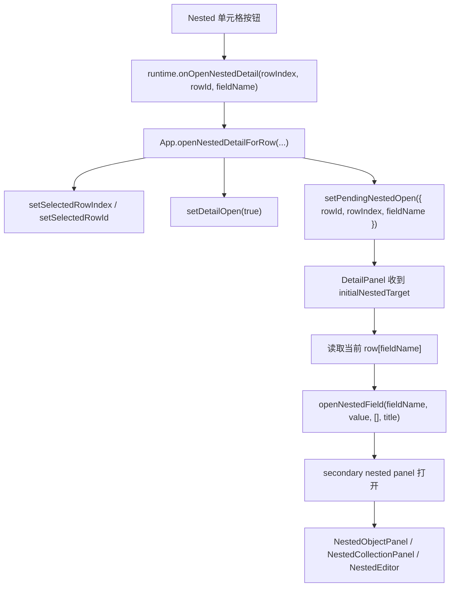

# 嵌套结构单元格直达详情嵌套编辑执行方案

## 方案概述

### 总体目标和范围

本方案用于把主表格中的 Nested 单元格，从当前“点击后仅选中当前行”的行为，调整为“点击后直接打开右侧 `DetailPanel`，并自动展开该字段对应的 nested detail”。目标行为是：

- 表格中的 `Object(2)`、`Object(5)`、`Object Array(2)` 等嵌套摘要，成为该字段的直接编辑入口。
- 点击 Nested 单元格后，右侧主详情面板与对应 secondary nested panel 一次性打开。
- 现有 `DetailPanel`、`NestedObjectPanel`、`NestedCollectionPanel`、`NestedEditor` 继续作为唯一嵌套编辑真值层，不新增第二套弹窗编辑器。
- 自动展开仅针对当前被点击的根字段级 nested 列，不把 path 级深层导航混进第一版。
- 现有非 nested 列、整行选中、标题列打开详情、relation/backlink/option 编辑行为不回归。

本轮范围包括：

- `table-columns.tsx` 中 nested 单元格入口语义改造。
- `DataTable.tsx` 的 runtime action 扩展。
- `App.tsx` 中“打开详情并指定待展开 nested 字段”的状态桥接。
- `DetailPanel.tsx` 中一次性自动展开 nested detail 的接入。
- 最小必要的 e2e / 类型检查 / 构建验证。

本轮不包括：

- 不新增居中 `Dialog` 弹窗式节点编辑器。
- 不改 nested editor 的字段编辑规则和写回模型。
- 不支持从表格直接跳到更深层 path，如 `root.a.b[2].c`。
- 不把这套直达语义推广到普通文本、relation、backlink 或其他列。
- 不顺手重构 `DetailPanel` 整体状态结构。

### 各阶段任务概要

第一阶段：确认入口与状态边界。  
主要工作是把当前 nested 单元格点击链路从“选中行”改为“打开详情并携带 nested 字段目标”，同时保持行选中和详情打开的现有职责不被打散。预期成果是 table runtime 具备明确的新动作入口。

第二阶段：落地 App 层桥接状态。  
主要工作是在 `App.tsx` 中引入一次性的 nested 打开目标，并将其与 `openDetailForRow(...)` 链路绑定。预期成果是点击表格 nested 单元格后，详情面板打开时已经知道该自动展开哪个字段。

第三阶段：接入 `DetailPanel` 自动展开。  
主要工作是在 `DetailPanel` 中接收目标字段，并在当前行数据就绪后自动执行一次 `openNestedField(...)`。预期成果是用户不需要在详情面板里再点击第二次 nested 按钮。

第四阶段：补回归验证与交互收口。  
主要工作是补对象型、对象数组型、重复点击、关闭重开、切行等路径的自动化断言，并确认非 nested 列无行为漂移。预期成果是新入口稳定可交付，而不是只在局部场景成立。

执行顺序为：表格入口 -> App 状态桥接 -> DetailPanel 自动展开 -> 自动化与运行态验证。

### 整体结构框架



---

## 现状证据与问题定义

### 当前 nested 单元格只负责选中行

`src/table/table-columns.tsx` 当前在 `columnModel.isNested` 分支里，将摘要内容渲染为：

- 一个 `button.nested-summary`
- 点击行为固定为 `runtime.onSelectRow(originalRowIndex, rowId)`

这说明现在的 `Object(2)` / `Object(5)` 只是“跳到当前行”的快捷入口，不是“打开 nested editor”的入口。

### 当前真正的 nested 编辑器已经存在

`src/detail/DetailPanel.tsx` 已经具备完整的 nested detail 打开链路：

- `openNestedField(fieldName, value, path, customTitle)`
- `nestedStack`
- `NestedObjectPanel`
- `NestedCollectionPanel`
- `NestedEditor`

也就是说，当前缺的不是编辑器能力，而是“从表格直接打到这套编辑器”的入口。

### 当前 detail 内部是二次点击模型

主详情面板中，如果字段值是对象或数组，当前会先渲染 `nested-entry-button`，用户还需要再点击一次，才进入 secondary nested panel。

因此当前用户链路是：

1. 点击表格 nested 单元格
2. 只选中行
3. 手动打开 detail
4. 在 detail 里再点 nested 按钮
5. 才进入 nested detail

你这次要解决的是第 1 步到第 5 步过长，而不是第 5 步不存在。

---

## 最终执行方案

## 1. 入口语义改造

Nested 单元格不再复用 `onSelectRow`，而是新增一条专门的 runtime action，例如：

```ts
onOpenNestedDetail(rowIndex, rowId, fieldName)
```

目标语义固定为：

- 点击 nested 单元格时，直接打开当前行详情
- 同时指定“要自动展开的是哪个根字段”
- 不再要求用户自己去 detail 里再找一次同名字段

这里要明确：

- 这一动作不是“直接在表格里编辑”
- 这一动作也不是“跳过详情，直接创建独立编辑器”
- 它只是把原本两段式交互，收敛成一段式入口

## 2. App 层引入一次性 nested 打开目标

`App.tsx` 需要新增一个一次性状态，建议表达为：

- `pendingNestedOpen`
- 或语义等价的 `{ rowId, rowIndex, fieldName, requestKey } | null`

该状态职责必须严格收口为：

- 只记录下一次 detail 打开后应自动展开哪个 nested 字段
- 不承担长期 UI 状态
- 执行成功后立即清空
- 必须带一次性请求标识，保证同一行、同一字段的重复点击也能再次触发消费

原因是：

- `DetailPanel` 会频繁 rerender
- `selectedRow`、`detailOpen`、panel width、字段编辑都可能触发重渲染
- 如果不把它设计成一次性消费状态，nested panel 会反复被自动顶开
- 如果没有 `requestKey` 之类的请求标识，同一行同一字段再次点击时，effect 可能因为依赖不变而不触发

## 3. 打开详情与记录 nested 目标必须同属于一条事务链

`App.tsx` 中需要新增类似 `openNestedDetailForRow(...)` 的桥接函数，职责应为：

1. 解析真实 `rowId` / `sourceIndex`
2. 清理与当前行选择相关的临时反馈
3. 设置 `selectedRowIndex`
4. 设置 `selectedRowId`
5. 打开 `detailOpen`
6. 写入带 `requestKey` 的 `pendingNestedOpen`

这里不建议分成“先调用 `openDetailForRow(...)`，再在外部零散补状态”的写法；更稳的方式是提供一个显式的高层入口，把这几个动作当成一次事务完成。

这里还要补一条强约束：

- 如果当前 detail 已打开，且用户在同一行点击了另一个 nested 字段，目标行为必须是“切换 secondary nested panel 到新字段”，而不是继续沿旧字段压栈
- 因此这条入口语义是“replace current root nested target”，不是“append another nested level”

## 4. `DetailPanel` 负责消费一次性目标并自动展开

`DetailPanel.tsx` 应新增一个输入，例如：

- `initialNestedTarget`
- 或等价命名

它的消费规则应固定为：

- 只有当 `open === true`
- 且当前 `row` 已就绪
- 且目标字段在当前 `row` 上确实是 object/array nested 值
- 且当前还没有消费过该目标

才自动调用一次：

```ts
openNestedField(fieldName, row[fieldName], [], title)
```

执行后：

- 通知上层清空该目标
- 或在本地用 key/ref 做“本轮已消费”保护

这一步的关键不是“怎么打开”，而是“如何保证只打开一次”。

这里必须显式处理当前 `DetailPanel` 已有的清空逻辑：

- 现有 `nestedStack` 会在 `rowId` 或 `open` 变化时被清空
- 自动展开不能和这段清空 effect 并发竞争
- 正确顺序应是：先完成新行/新打开态导致的旧 stack 清空，再消费 `initialNestedTarget`

因此实现上应采用“两段式时序”：

1. 选择状态与 `open` 完成切换
2. `DetailPanel` 在新的 `rowId/open` 稳定后，再消费一次性 nested 目标

如果把自动展开直接塞进与 `open` 同步的流程里，存在“刚压入 nestedStack 又被清空 effect 抹掉”的风险。

## 5. 自动展开只支持根字段级 nested

第一版必须把边界写死：

- 只支持表格列对应的根字段，例如 `stat_growth`、`starting_stats`
- 不支持直接从主表某个摘要跳进更深层 path
- 不把 `pathSuffix` / 深层导航状态塞进入口协议

原因是主表列模型当前天然就是根字段级，先按这一层做完，结构最稳定，也最符合这次需求截图所指向的场景。

同时需要定义空值行为：

- 如果某列是 nested 列，但当前行该字段值为空、`null`、或不是 object/array
- 点击后仍可打开 primary detail
- 但不应强行打开 secondary nested panel
- 本次请求应被视为已消费，不重复尝试自动展开

这样可以避免“一部分行能弹 secondary panel、一部分行 silently fail”却没有规则解释的问题。

## 6. secondary nested panel 的行为不重写

自动展开完成后，后续的 nested 导航、对象字段编辑、对象数组项切换、继续向更深层 nested drill down，全部继续复用现有 `DetailPanel` 体系：

- `NestedObjectPanel`
- `NestedCollectionPanel`
- `renderNestedItemEditor(...)`
- `NestedEditor`

这是一条硬约束：

- 不新增第二套状态机
- 不在 `App.tsx` 复制 nestedStack
- 不在表格层承担 nested 编辑责任

---

## 文件级执行清单

### `src/table/table-columns.tsx`

目标：

- 修改 `columnModel.isNested` 分支的点击行为
- 从 `runtime.onSelectRow(...)` 切到 `runtime.onOpenNestedDetail(...)`
- 保留 `summarizeNestedValue(value)` 作为摘要文案，不改视觉摘要模型

约束：

- 不改非 nested 分支
- 不把 nested cell 改成内联编辑器
- 如需保留键盘可达性，继续使用 button 语义元素

### `src/table/DataTable.tsx`

目标：

- 扩展 runtime contract，新增 `onOpenNestedDetail`
- 透传到表格 cell renderer
- 保持 `onSelectRow`、`onOpenDetail` 现有职责不混淆

约束：

- 不把 nested 行为偷塞进已有 `onOpenDetail`
- 不在 `selectRow(...)` 内加嵌套条件分支

### `src/App.tsx`

目标：

- 新增 `pendingNestedOpen` 之类的一次性目标状态
- 新增 `openNestedDetailForRow(...)` 入口
- 将该入口传给 `DataTable`
- 把 nested 打开目标传入 `DetailPanel`
- 在目标消费后清空状态
- 目标结构应包含一次性 `requestKey`

约束：

- 只保留一份 nested 自动展开目标
- 不把 nested 打开状态做成全局持久化 UI 状态
- 不影响普通 `openDetailForRow(...)` 路径
- 同一行切换 nested 字段时，语义必须是 replace 当前 root nested target

### `src/detail/DetailPanel.tsx`

目标：

- 接收 `initialNestedTarget`
- 在条件满足时自动执行一次 `openNestedField(...)`
- 与当前 `nestedStack` 共存，不重写现有 nested 导航结构

约束：

- 自动展开不能在每次 rerender 时重复触发
- 如果目标字段当前不是 nested 值，应安全忽略并结束本次消费
- 不在这里反向修改表格选择状态
- 必须处理好 `setNestedStack([])` 与自动展开之间的执行顺序
- 同一行切字段时，应替换当前 root nested 目标，而不是继续向旧 stack 追加

### `tests/data-editor.spec.ts`

目标：

- 新增主表 nested 单元格直达 nested detail 的 e2e 用例
- 覆盖对象型和对象数组型 nested
- 覆盖切行、关闭重开、重复点击边界
- 覆盖 detail 已打开时，同一行点击另一个 nested 字段的切换边界
- 覆盖 nested 列在某一行为空值时“只打开 primary detail、不打开 secondary panel”的边界

约束：

- 断言应基于现有 `.detail-panel.primary`、`.detail-panel.secondary.open`、`.nested-item-list`、`.property-block` 等稳定 DOM 合同
- 不把测试写成依赖视觉截图的脆弱断言

---

## 自动化验证方案

## 第一阶段：建立测试锚点

在改实现前，先补一组能够表达新需求的回归断言，至少包括：

1. 打开包含 nested 字段的数据文件
2. 在表格中点击 nested 单元格摘要按钮
3. 断言：
   - `.detail-panel.primary` 可见
   - `.detail-panel.secondary.open` 可见
4. 对对象型 nested，断言 secondary panel 中能看到对象字段名
5. 对对象数组型 nested，断言能看到 `.nested-item-list`
6. 在 detail 已打开的情况下，点击同一行另一个 nested 单元格，断言 secondary panel 内容切换到新字段，而不是沿旧 stack 追加
7. 对空值行，断言 primary detail 打开，但 `.detail-panel.secondary.open` 不出现

目标是先把“点击 nested cell 应直接落到 nested detail”变成稳定测试合同。

## 第二阶段：类型与构建验证

实现后至少执行：

```powershell
npm run typecheck
npm run build
```

如果新增了局部 helper 或 runtime 类型扩展，这两步应能第一时间发现断层。

## 第三阶段：目标 e2e 验证

建议优先跑与 nested detail 相关的目标用例，而不是一上来全量回归：

```powershell
npx playwright test tests/data-editor.spec.ts -g "table nested cell opens matching nested detail directly"
```

如实际落地时拆成多条用例，也应保持标题前缀精确，不要用过宽的 `nested` 关键词过滤整组无关用例。

## 第四阶段：运行态人工验收

人工验收时至少覆盖：

- 点击 `Object(n)` 后是否一次性打开 primary + secondary panel
- 点击 `Object Array(n)` 后是否直接进入 collection panel
- 点击另一行 nested 单元格时，是否切到新行而不是保留旧 nested 内容
- detail 已打开时，点击同一行另一列 nested 单元格，是否切换为新字段而不是保留旧 drill-down
- 关闭 detail 后重新点击，是否还能正确自动展开
- nested 列在空值行点击时，是否只打开 primary detail 而不错误展开 secondary panel
- 点击非 nested 列时行为是否完全不变

---

## 风险与规避

### 风险 1：自动展开在 rerender 中重复触发

风险：

- 调整 panel 宽度、编辑字段、切换 focus 时，secondary panel 被重复压栈

规避：

- nested 打开目标设计为一次性消费状态
- `DetailPanel` 内部增加“已消费目标”保护

### 风险 2：打开的是正确行，但展开的是上一行字段

风险：

- 状态顺序不对时，`pendingNestedOpen` 可能在旧 row 上被消费

规避：

- `openNestedDetailForRow(...)` 内统一设置选择与目标
- 消费前核对 `rowId` 或解析后的 source index

### 风险 3：同一行切换 nested 字段时，旧 stack 被错误保留

风险：

- detail 已打开时，从 `stat_growth` 切到 `starting_stats`
- secondary panel 仍沿旧字段继续压栈，导致内容和用户点击目标不一致

规避：

- 将表格 nested 入口定义为“replace current root nested target”
- 同一行切字段时重置当前 root nested 状态，再打开新字段

### 风险 4：对象数组与对象值的标题/默认选中不一致

风险：

- 对象型 nested 直接展示属性编辑
- 对象数组型 nested 需要 collection panel + selected item
- 若自动展开逻辑混淆，会出现空 secondary panel

规避：

- 复用当前 `openNestedField(...)` 的类型分流
- 第一版不额外发明新的 nested 类型协议

### 风险 5：nested 列的空值行行为不一致

风险：

- 某列在列模型上是 nested，但当前行值为空
- 点击后如果没有规则，可能出现无反馈、错误展开、或重复尝试消费

规避：

- 把空值行为写死为“打开 primary detail，但不打开 secondary panel”
- 本次请求消费后立即结束，不重试

### 风险 6：语义扩散到其他列

风险：

- 为了图省事，把“点击单元格打开详情并展开”扩散到普通字段

规避：

- 改动只落在 `columnModel.isNested` 分支
- 不触碰普通文本、title、relation、backlink 分支

### 风险 7：测试只断言 primary panel 打开，漏掉 secondary nested panel

风险：

- 最终只实现成“点击 nested cell 打开详情”，没有真正自动展开 nested detail

规避：

- 测试必须显式断言 `.detail-panel.secondary.open`
- 并断言 nested 内容真实出现

---

## 完成定义

本执行方案完成时，应同时满足：

1. 主表 nested 单元格点击后，不再只是选中行。
2. 点击后能直接打开当前行 `DetailPanel`。
3. 对应字段的 secondary nested panel 会自动展开。
4. 对象型 nested 与对象数组型 nested 都能正确进入各自现有编辑面板。
5. 同一行切换不同 nested 字段时，secondary panel 会切换到新字段，而不是保留旧 stack。
6. nested 列遇到空值行时，只打开 primary detail，不错误展开 secondary panel。
7. 自动展开不会在 rerender 中重复触发。
8. 非 nested 列行为不变。
9. `npm run typecheck`、`npm run build`、目标 nested e2e 验证通过。

---

## 最终建议

执行时应坚持一个核心约束：这轮改的是“入口”，不是“编辑器”。

因此最优路径不是新做 modal，也不是在表格里硬塞 nested inline editor，而是把主表 nested 单元格接到当前已经成熟的 `DetailPanel -> nested detail` 链路上。这样改动面最小，状态真值最单一，回归风险也最可控。
