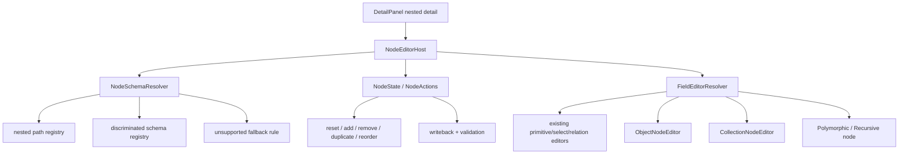

# 嵌套节点完整编辑执行方案

## 方案概述

### 总体目标和范围

本方案用于把 [2026-07-09-嵌套节点完整编辑方案.md](/C:/Code/data-editor/docs/plans/2026-07-09-%E5%B5%8C%E5%A5%97%E8%8A%82%E7%82%B9%E5%AE%8C%E6%95%B4%E7%BC%96%E8%BE%91%E6%96%B9%E6%A1%88.md) 落成可执行的第一轮实现。目标不是继续给当前 `NestedObjectPanel` / `NestedCollectionPanel` 补局部按钮，而是把右侧 `nested detail` 升级为一套统一的 nested node editing framework，并先覆盖最有价值、最稳定的一批节点类型。

目标结果是：

- 右侧 nested detail 不再只依赖当前值猜类型，而是按 `NodeSchema` 渲染节点。
- `classes`、`affixes`、`affixes_mechanic` 这类固定字段 object / object array 节点，可以稳定完成完整编辑。
- `skills.nodes[]`、`runes.effects[].params`、`traits.effects[]` 这类多态节点，进入同一套框架，而不是另起一套编辑器。
- nested 节点内部的 `text / number / boolean / select / relation / multi-select` 叶子字段复用现有字段编辑能力，不重做顶层字段系统。
- 未命中 schema 的复杂结构，进入受控 fallback，而不是伪装成“完整节点编辑”。

本轮范围包括：

- `DetailPanel` nested 入口下的统一 schema 命中与节点宿主。
- object 节点、object array 节点、多态节点、递归节点的统一编辑运行时。
- nested 场景下的 relation/select 语义复用。
- unsupported nested 结构的 fallback UX。
- 最小必要的自动化测试、类型检查、构建验证。

本轮不包括：

- 不重做顶层 `DetailPanel` 非 nested 字段编辑体系。
- 不支持任意 object key 的自由结构编辑。
- 不支持任意 mixed array 的高级 JSON 编辑器。
- 不做全局撤销/重做。
- 不做跨节点模板应用、批量编辑、流程图式编辑。

### 各阶段任务概要

第一阶段：建立 schema 真值与 resolver 边界。  
主要工作是引入统一 `NodeSchema`、schema registry、resolver 命中顺序和 unsupported fallback 判定规则。预期成果是 nested 编辑入口从值推断改为 schema 驱动。

第二阶段：抽离统一节点编辑底座。  
主要工作是把当前值驱动 nested 逻辑收口到 `NodeEditorHost`、`ObjectNodeEditor`、`CollectionNodeEditor`、`FieldEditorResolver` 等分层。预期成果是基础节点层和多态节点层共用一套宿主与写回契约。

第三阶段：完成基础节点层。  
主要工作是落 object / object array 的 header、默认值恢复、复制删除排序、语义化空值，以及 nested relation/select 基础编辑。预期成果是 `starting_equipments`、`value_model`、`constraints` 一类节点可完整编辑。

第四阶段：接入多态与递归节点。  
主要工作是为 `skills.nodes[]`、`runes.effects[].params`、`traits.effects[]` 接入判别式 schema、类型切换、默认值重建和递归节点契约。预期成果是复杂节点也能沿同一条写回链稳定工作。

第五阶段：验证、回归与收口。  
主要工作是补测试矩阵、收口 fallback、核对现有非 nested 字段行为不回归。预期成果是功能具备持续迭代基础，而不是一次性的 UI 增强。

执行顺序为：schema registry -> 节点底座 -> 基础节点层 -> 多态/递归节点层 -> 测试与收口。

### 整体结构框架



---

## 执行前固定约束

### 统一边界

本轮一定要坚持以下边界：

- 只新增 nested node editing framework，不重做顶层字段编辑器。
- 顶层字段 editor 仍是正式能力来源；nested 叶子字段只复用，不复制一套简化实现。
- `NodeEditorHost`、`FieldEditorResolver`、写回链、校验链只有一套。
- “基础节点层”和“多态节点扩展层”只是 schema 命中路径不同，不是两套实现。

### schema 真值来源

本轮必须先把 schema 真值放进独立 registry / resolver 模块，不能把 schema 逻辑散落在：

- `DetailPanel.tsx`
- `NestedEditor.tsx`
- 单个字段编辑器内部

schema 命中顺序固定为：

1. 先按数据文件 + root field + nested path 命中基础 schema。
2. 若命中 collection item 或多态节点，再按 `type` / `effect_type` / 等价判别字段命中分支 schema。
3. 若 schema 声明递归子节点，则对子路径重复同一套 resolver。
4. 若未命中 supported schema，则进入受控 fallback。

resolver 的稳定命中 key 也必须先写死，避免第一阶段反复返工。建议固定为：

- `sourcePath`
- `collectionPath`
- `rootField`
- `nestedPath`
- `discriminator`（如 `type`、`effect_type`）

其中：

- `sourcePath + collectionPath + rootField + nestedPath` 负责命中基础 schema
- `discriminator` 只在命中多态节点后参与第二段分流
- 不直接把“当前值长什么样”当作 schema 命中主依据

这样可以保证 `classes.starting_equipments`、`runes.effects[].params`、`skills.nodes[]` 这类结构都按统一规则解析，而不是混用文件语义和样本值语义

### fallback 边界

本轮明确不做任意 JSON 编辑。因此必须提前定义：

- supported schema：进入完整节点编辑器
- primitive 或现有安全结构：走现有轻量编辑
- complex unsupported object / array：显示只读 fallback + 原始结构预览

禁止出现“未命中 schema 但看起来像完整节点编辑”的伪能力。

### 导航状态归属

当前 secondary nested panel 已经有 `nestedStack` 这一套导航真值。本轮执行必须明确：

- `nestedStack` 继续作为 nested 导航状态真值保留
- `NodeEditorHost` 负责消费当前 `rootField + path + value + schema`
- 新框架替换的是“当前 path 对应节点如何编辑”，不是重写整套 secondary panel 导航状态机

原因是：

- 当前 `DetailPanel` 已有稳定的 nested drill-down 入口
- 这轮核心风险在 schema 化与节点编辑，不在重写导航
- 若同时重写导航状态机，会把递归节点接入和基础节点落地绑在一起，范围会迅速失控

---

## 现状与目标映射

### 当前实现问题

当前 nested 体系主要问题有四类：

- 依赖 `defaultTypeFor(value)` 等当前值推断，空值字段语义丢失。
- `makeEmptyNestedItem(...)` 之类逻辑只能按样本造空值，不是真正的 schema 默认值。
- object array 节点缺复制、排序、默认值恢复等完整节点操作。
- `skills.nodes[]`、`runes.effects[].params`、`traits.effects[]` 这类真实多态节点没有统一 schema 分流能力。

### 本轮优先覆盖的数据形状

结合当前主要数据文件，执行时应按以下优先级推进：

1. `classes.starting_equipments`、`classes.starting_stats`、`classes.stat_growth`
2. `affixes.value_model`、`affixes.constraints`
3. `affixes_mechanic.effect_spec`、`affixes_mechanic.constraints`
4. `traits.effects[]`
5. `runes.effects[].params`
6. `skills.nodes[]`

原因是：

- 前三类是固定字段 object/object array，最适合先建立基础层合同。
- 后三类是多态甚至递归节点，适合在底座稳定后接入。

---

## 文件级执行清单

### `src/detail/DetailPanel.tsx`

目标：

- 从现有容器角色收口为 nested node editing host 的入口层。
- 接入 `NodeEditorHost` 或等价宿主组件。
- 保留主/次级 panel 导航职责，不在这里堆 schema 细节。

约束：

- 不继续在 `DetailPanel` 内扩张值推断式 nested 逻辑。
- 不把多态 schema 判定硬编码在这里。

### `src/detail/NestedEditor.tsx`

目标：

- 从“按值决定控件”的通用 nested renderer，逐步收口为字段级 editor 分发层或被新 resolver 替代。
- 能复用现有 primitive / relation / select editor，而不是继续本地推断。

约束：

- 不保留新的 schema 逻辑与旧的值推断逻辑长期并行。
- 新框架落地后，应清理旧分支，而不是做防御性兼容。

### `src/detail/*` 新增节点编辑模块

建议新增明确分层文件，而不是继续把逻辑堆在一个组件中。建议至少包括：

- `src/detail/node-schema.ts`
  - 定义 `NodeSchema`、字段 schema、判别式 schema、递归 schema 契约
- `src/detail/node-schema-registry.ts`
  - 维护 nested path registry 与 discriminated schema registry
- `src/detail/NodeEditorHost.tsx`
  - 负责 schema 解析、节点状态、写回桥接、fallback 分流
- `src/detail/ObjectNodeEditor.tsx`
  - 负责固定字段 object 节点
- `src/detail/CollectionNodeEditor.tsx`
  - 负责 object array 节点及数组项工具栏
- `src/detail/PolymorphicNodeEditor.tsx`
  - 负责判别字段、多态节点切换、递归进入

### 现有字段编辑器与 resolver 层

目标：

- 新增或抽出 `FieldEditorResolver`
- 按字段 schema 复用现有：
  - text editor
  - number editor
  - boolean editor
  - select / multi-select editor
  - relation editor

约束：

- 不为 nested 场景再造一套 relation/select 简化控件。
- 如果现有字段编辑器依赖顶层上下文，需要补 adapter，而不是复制实现。

执行前应明确 `FieldEditorResolver` / adapter 最小输入契约，至少包括：

- `displayType`
- `fieldName`
- `fieldViewConfig`
- `relationConfig`
- `relationOptions`
- `value`
- `validationIssue`
- `onEdit`
- `onCommitSelectDraft`
- `onCommitMultiSelectDraft`
- `onOpenRelationTarget`
- `onRegisterActiveTextEditor`

这样写死的原因是当前 `DetailPanel` 里的 relation/select/multi-select/editor 不是纯展示控件，而是依赖一组运行时上下文和 draft 提交链。若不先定义 adapter contract，实施时很容易低估 nested 复用成本。

### 测试文件

建议覆盖：

- `tests/data-editor.spec.ts`
  - e2e 验证 nested node editor 打开与关键交互
- 新增单元测试文件，例如：
  - `tests/node-schema.test.mjs`
  - `tests/node-schema-registry.test.mjs`
  - `tests/nested-node-editor.test.tsx`

---

## 分阶段执行方案

## 第一阶段：建立 schema registry 与 fallback 契约

### 目标

- 建立 nested 编辑的统一 schema 真值来源。
- 明确 supported / unsupported 结构边界。

### 具体执行

1. 定义 `NodeSchema`、`NodeFieldSchema`、`CollectionItemSchema`、`DiscriminatedNodeSchema` 基础类型。
2. 明确字段级最小能力集：
   - `displayType`
   - `required`
   - `nullable`
   - `defaultValue`
   - `optionSource`
   - `relationConfigKey`
   - `nestedSchema`
3. 新增 nested path registry：
   - `classes.starting_equipments`
   - `classes.starting_stats`
   - `classes.stat_growth`
   - `affixes.value_model`
   - `affixes.constraints`
   - `affixes_mechanic.effect_spec`
   - `affixes_mechanic.constraints`
4. 新增 discriminated registry：
   - `traits.effects[]` 按 `type`
   - `runes.effects[].params` 按 `effect_type`
   - `skills.nodes[]` 按 `type`
5. 定义 unsupported fallback contract：
   - fallback 标题
   - 只读结构预览
   - 不可编辑说明
6. 补 registry / resolver 单元测试，先让命中规则变成稳定合同。
7. 新增 schema lookup 示例测试，至少覆盖：
   - `classes.starting_equipments`
   - `runes.effects[].params` + `effect_type`
   - `skills.nodes[]` + `type=condition`

### 验收标准

- 给定 nested path 能稳定命中 schema。
- 给定多态节点值能稳定命中分支 schema。
- 未命中 schema 的复杂结构不会进入完整编辑器。

## 第二阶段：落地 NodeEditorHost 与字段分发

### 目标

- 用统一宿主替换当前值推断式 nested 主流程。

### 具体执行

1. 新增 `NodeEditorHost`：
   - 输入 `rootField / path / value / row context`
   - 输出 object editor、collection editor、polymorphic editor 或 fallback
2. 新增 `FieldEditorResolver`：
   - 按 schema 决定 primitive/select/relation/nested editor
   - 不再按值推断决定
3. 打通写回桥接：
   - 继续复用现有 path 写回
   - 不引入第二套保存模型
4. 打通校验桥接：
   - 至少支持 required / type / relation/select 基础校验
5. 在 `DetailPanel` 里切到新宿主，但先只接基础 object 节点。
6. 明确新宿主与现有导航状态的关系：
   - `DetailPanel` 继续维护 `nestedStack`
   - `NodeEditorHost` 不另建第二套 nested 导航状态
   - drill-down 仍通过现有 `openNestedField(...)` 或等价路径推进

### 验收标准

- object 节点可以在新宿主下稳定渲染。
- nested 叶子字段可复用现有 editor。
- 写回链不脱离当前 `onEditField(...)` / path 更新模式。

## 第三阶段：完成基础节点层

### 目标

- 让固定字段 object / object array 节点具备完整操作。

### 具体执行

1. 完成 `ObjectNodeEditor`：
   - 节点标题
   - 摘要
   - 必填完成度
   - 当前校验状态
   - 恢复默认值
2. 完成 `CollectionNodeEditor`：
   - 新增项
   - 删除项
   - 复制项
   - 上移 / 下移
   - 项摘要
3. 为空值字段补语义化展示：
   - relation：未关联
   - select：未选择
   - business slot：未装备 / 未配置
4. 把 nested relation/select/multi-select 的基础编辑放进这一阶段，不后置。

### 验收标准

- `classes.starting_equipments` 可完整编辑。
- `affixes.value_model` / `constraints` 可完整编辑。
- object array 节点支持增删复制排序。

## 第四阶段：接入多态与递归节点

### 目标

- 把真实复杂数据纳入同一套框架。

### 具体执行

1. 完成 `PolymorphicNodeEditor`：
   - 读取判别字段
   - 切换 schema
   - 类型切换后重建默认值
2. 接入 `traits.effects[]`
3. 接入 `runes.effects[].params`
4. 接入 `skills.nodes[]`
5. 明确递归节点 contract：
   - 新增
   - 删除
   - 复制
   - 排序
   - 类型切换
   - 默认值重建
6. 对 `condition.then_nodes` / `else_nodes` 这类递归场景复用同一套 contract。

### 验收标准

- `traits.effects[]` 能按 `type` 稳定编辑。
- `runes.effects[].params` 能按 `effect_type` 稳定切换。
- `skills.nodes[]` 的递归节点能继续展开编辑，不断链。

## 第五阶段：验证、回归与清理旧逻辑

### 目标

- 形成稳定回归矩阵，并移除旧值推断路径。

### 具体执行

1. 补自动化测试矩阵：
   - object node
   - object array
   - polymorphic node
   - recursive node
   - empty node
   - relation/select nested field
   - unsupported fallback
2. 跑目标验证：

```powershell
npm run typecheck
npm run build
```

3. 视实际测试设施补：

```powershell
npx playwright test tests/data-editor.spec.ts -g "nested node"
```

4. 清理旧值推断分支：
   - 不保留长期并行实现
   - 不做旧机制兼容保留
   - 清理范围只限 nested secondary panel 主路径
   - 不把 primary detail 顶层字段的现有推断逻辑混进本轮清理

### 验收标准

- 新节点框架通过目标测试。
- 旧值推断主路径被清理。
- 非 nested 字段编辑行为不回归。

---

## 风险与规避

### 风险 1：schema registry 设计不清，最终又退回值推断

规避：

- 第一阶段先把 registry / resolver 做成显式模块与测试合同。

### 风险 2：nested 场景复制一套 relation/select 控件

规避：

- 明确要求 nested 叶子字段复用现有 editor，只做 adapter，不复制逻辑。

### 风险 3：多态节点先做成单独编辑器，破坏统一模型

规避：

- 多态节点只能作为 `NodeEditorHost` 下的一个分支，不允许独立状态机。

### 风险 4：递归节点只做展示，操作契约断裂

规避：

- 把递归层的新增、复制、排序、类型切换写成与顶层同构的硬要求。

### 风险 5：unsupported 结构被错误当成已支持

规避：

- fallback 明确为只读/轻量预览，不进入完整节点编辑流程。

### 风险 6：旧逻辑与新逻辑长期并行

规避：

- 项目处于早期阶段，本轮完成后直接清理 nested secondary panel 的旧值推断主路径，不做防御性兼容。
- 但顶层 primary detail 的非 nested 字段编辑链不在本轮清理范围内，避免边界失焦。

---

## 建议提交边界

建议至少按以下边界拆提交：

1. `schema types + registry + resolver tests`
2. `NodeEditorHost + object/collection node editors`
3. `relation/select nested reuse + base node regression`
4. `polymorphic + recursive node support`
5. `fallback + cleanup + final regression`

这样做的原因是：

- schema 真值、基础节点、多态节点、收尾回归边界清楚
- 每一轮失败都容易定位
- 不会把“fixed schema 落地”和“recursive node 接入”混成一团

---

## 完成定义

本执行方案完成时，应同时满足：

1. nested detail 主流程由 schema 驱动，不再依赖当前值猜类型。
2. `classes`、`affixes`、`affixes_mechanic` 的核心 nested 节点可以完整编辑。
3. `traits.effects[]`、`runes.effects[].params`、`skills.nodes[]` 进入同一套多态/递归框架。
4. nested 内部 relation/select/multi-select 字段复用现有 editor，而不是另造一套。
5. unsupported 复杂 nested 结构稳定进入受控 fallback。
6. 自动化验证、`typecheck`、`build` 通过。
7. 旧值推断式 nested 主路径被清理，不保留长期双轨。
8. `nestedStack` 继续作为导航真值保留，新框架不额外引入第二套 nested 导航状态。

---

## 最终建议

执行时要始终坚持一个核心判断：这轮改造的主语不是“字段控件”，而是“节点模型”。

因此最稳的路径不是继续给 `NestedEditor` 局部打补丁，而是先把 schema 真值、节点宿主、字段分发和 fallback 边界立起来，再按“固定节点 -> 多态节点 -> 递归节点”推进。这样做既能覆盖当前主要数据文件，也不会把文档重新读成“顶层字段重构”或“两套编辑器并行维护”。
