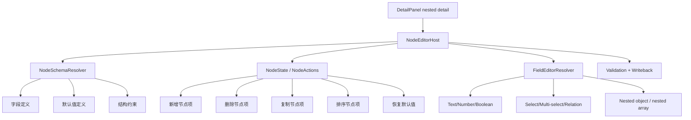

# 嵌套节点完整编辑方案

## 方案概述

### 总体目标和范围

本方案用于把当前右侧 `nested detail` 从“通用值编辑面板”升级为“schema-aware 的完整节点编辑器”。目标不是继续增强一组基于当前值推断类型的表单控件，而是建立一套统一的节点编辑框架，让编辑器能够理解字段语义、空值语义、默认值、结构边界、节点类型和节点操作。

本方案是**一个统一方案**，不是两套并行方案，也不是两套编辑器。统一框架内部按节点复杂度分两层推进：

- 基础节点层：固定字段 object 节点、object array 节点、schema 驱动的 text / number / boolean / select / multi-select / relation / nested 子节点编辑、类型化空值渲染、默认值恢复、节点级增删改排基础操作、节点级校验与错误提示
- 多态节点扩展层：按 `type` / `effect_type` / 等价判别字段分流 schema 的节点、节点类型切换、类型切换后的默认值重建、递归子节点编辑

统一框架完成后，应能覆盖：

- `classes`、`affixes`、`affixes_mechanic` 这类以固定字段 object / object array 为主的数据
- `traits`、`runes`、`skills` 这类包含多态节点或递归节点的数据

本轮明确不包括：

- 不支持任意 object key 的自由结构编辑
- 不支持任意 mixed array 的高级结构编辑器
- 不做全局撤销/重做
- 不做多节点批量编辑
- 不做跨节点模板应用或复杂可视化流程图式编辑

本方案解决的是“完整节点编辑”而不是“任意 JSON 编辑”。这里的“完整”是指：编辑器能够按 schema 理解节点，提供节点级操作、字段级类型语义和稳定校验，而不是只把 object 展平为若干输入框。

为避免后续再次产生误解，这里再明确一条统一原则：

- `NodeEditorHost`、`FieldEditorResolver`、写回链、校验链、导航链只有一套
- “基础节点层”和“多态节点扩展层”只是同一框架内的两类 schema 命中路径，不是两套实现，不是两套 UI，不是两套维护面

同时明确一条边界声明：

- 本方案新增的是 nested node editing framework，不是重做整套顶层字段编辑系统
- 顶层字段现有 editor 仍是正式能力来源；nested 场景只是在节点框架内复用这些字段 editor，不单独再造一套
- 因此文档中提到 `text / number / boolean / select / relation / multi-select`，指的是“nested 节点内部叶子字段也要保留正式字段语义”，不是把非嵌套字段一起纳入本次重构范围

### 各阶段任务概要

第一阶段：定义统一 schema 真值与节点分层。  
主要工作是明确哪些 nested 路径进入节点编辑器，并把节点统一分成“基础节点”和“多态节点”两类，建立 schema 来源、默认值模型和字段级语义约束。预期成果是编辑器不再依赖当前值猜类型，且不会被误解为需要两套实现。

第二阶段：抽离统一节点编辑运行时与通用组件。  
主要工作是把当前 `NestedObjectPanel` / `NestedCollectionPanel` / `NestedEditor` 背后的值驱动逻辑升级为 node-driven 结构，建立统一的 `NodeSchema`、`NodeEditorHost`、`NodeEditor`、`FieldEditorResolver` 分层。预期成果是基础节点层和多态节点扩展层共用同一套底层框架。

第三阶段：落地基础节点层交互。  
主要工作是补齐固定字段 object 节点、object array 节点的 header、摘要、默认值恢复、数组项新增/删除/复制/排序、字段状态提示、空值语义和 relation/select 语义。预期成果是 `starting_equipments` 这类场景先完整落地。

第四阶段：落地多态节点扩展层交互。  
主要工作是为 `skills.nodes`、`runes.effects[].params`、部分 `traits.effects` 这类多态节点接入判别式 schema、类型切换、默认值重建和递归子节点编辑。预期成果是复杂节点也能在同一框架内编辑，而不是另起一套编辑器。

第五阶段：接入校验、写回与回归验证。  
主要工作是让统一节点编辑框架与现有写回链、校验链、详情面板导航链稳定耦合，并补充自动化测试。预期成果是该能力可持续迭代，不是一次性的局部 UI 增强。

执行顺序为：统一 schema 分层 -> 通用组件 -> 基础节点层 -> 多态节点扩展层 -> 校验与验证。

### 整体结构框架

---

## 现状分析

### 当前 nested detail 更像值编辑面板

当前右侧 nested detail 主要由以下几个实现组成：

- `DetailPanel.tsx` 中的 `NestedObjectPanel`
- `DetailPanel.tsx` 中的 `NestedCollectionPanel`
- `NestedEditor.tsx`

它们已经能完成一部分嵌套值编辑，但核心模型仍然是：

- 读到当前值
- 通过 `defaultTypeFor(value)` 推断字段类型
- 再决定渲染哪种输入控件

这意味着当前能力的上限更接近“把 object 展开成一组编辑控件”，而不是“编辑一个有明确结构和语义的节点”。

### 当前模式的主要问题

#### 1. 空值节点没有语义

像 `helm`、`boots` 这种空值字段，当前只能显示为空输入框。编辑器不知道它是：

- 普通文本空值
- relation 空值
- 固定槽位未设置
- 可恢复默认值的业务字段

因此空值体验非常弱。

#### 2. 类型主要依赖当前值推断

当前 nested 字段的展示大量依赖值本身，而不是字段 schema。这样会导致：

- 空值时类型信息丢失
- 默认值生成不准确
- 关系字段/枚举字段无法稳定还原语义
- 节点初始创建能力弱

#### 3. 缺少节点级操作

当前实现能改值，但节点级操作很不完整，尤其缺：

- 对象节点级重置
- 数组项复制
- 数组项排序
- 字段默认值恢复
- 结构边界提示

这会让嵌套编辑在复杂数据上很快变得难用。

#### 4. 默认值模型过弱

当前 `makeEmptyNestedItem(...)` 主要按样本形状造空字符串或空对象，这不足以支撑真正的节点创建。它不知道：

- number 默认是不是 `0`
- boolean 默认是不是 `false`
- relation 默认是不是 `null`
- select 默认是否有显式空态
- 某些字段是否根本不允许空字符串

#### 5. 业务语义未进入 nested 编辑器

像 `starting_equipments` 这种节点，本质上不是匿名 object，而是“装备槽位节点”。当前编辑器没有槽位语义，也没有目标值过滤规则，因此还停留在“编辑 JSON”的阶段。

---

## 目标定义

## 1. 什么叫“完整节点编辑”

本方案中的“完整节点编辑”不等于“无限制 JSON 编辑器”，而是指以下能力同时成立：

1. 编辑器知道当前 nested 值对应什么节点类型。
2. 编辑器知道节点有哪些字段、每个字段的展示类型和默认值。
3. 空值节点也能稳定渲染，不依赖当前值推断。
4. 节点具备基础结构操作能力，而不仅是修改已有值。
5. 节点编辑结果能进入现有写回和校验链。
6. 同一套框架既能支撑固定 schema 节点，也能支撑按判别字段分流的多态节点。

## 2. 统一方案的目标能力

统一方案的目标能力分成两层，但两层共享同一套底层框架：

### 基础节点层

- 固定字段 object 节点编辑
- object array 节点编辑
- 类型化字段编辑
- 默认值恢复
- 数组项新增/删除/复制/排序
- 节点摘要与节点 header
- 必填/类型/关系合法性校验
- relation/select 语义化空态

### 多态节点扩展层

- 按 `type` / `effect_type` / 等价判别字段分流 schema
- 节点类型切换
- 类型切换后的默认值重建
- 多态对象数组项编辑
- 递归子节点编辑

这样定义以后，`classes/affixes/affixes_mechanic` 和 `skills/runes/traits` 都是同一总方案的覆盖范围，只是进入统一框架的不同层级。

---

## 方案设计

## 1. 引入 NodeSchema 作为 nested 编辑真值

完整节点编辑的前提，是 nested path 不再只依赖当前值，而是能解析出稳定的 `NodeSchema`。

`NodeSchema` 至少应包含：

- `nodeKind`
- `title`
- `description`
- `fields`
- `allowUnknownFields`
- `defaultValue`
- `itemSchema`（数组节点）

字段级 schema 至少应包含：

- `fieldName`
- `displayType`
- `required`
- `nullable`
- `defaultValue`
- `placeholder`
- `relationConfigKey` / `optionSource`
- `nestedSchema`（子节点）

这一层的核心价值是：

- 空值字段也能按 schema 渲染
- 默认值和恢复逻辑稳定
- 节点创建可以摆脱样本值猜测

### NodeSchema 的真值来源必须固定

统一方案能否成立，关键不在于有没有一个 `NodeSchema` 类型定义，而在于 schema 到底由谁提供、按什么键命中、放在哪里维护。

这里建议直接收敛成一套固定 registry / resolver 模型：

- `nested path registry`：按数据文件、根字段、path 片段定义 schema 入口
- `discriminated schema registry`：按 `type` / `effect_type` / 等价判别字段定义多态分支
- `schema factory`：负责默认值、字段顺序、空值语义、节点标题、节点摘要

推荐的命中顺序：

1. 先按当前数据文件和 root field 命中基础 schema
2. 若命中的是 collection item 或 polymorphic node，再读取判别字段继续命中分支 schema
3. 若 schema 明确声明递归子节点，则对子路径重复同一套 resolver 过程
4. 若最终未命中 supported schema，则进入受控 fallback，而不是退回值推断式完整编辑

这一步必须在实现前写死职责边界：

- schema 真值维护在独立 registry / resolver 模块
- `DetailPanel` 不维护 schema
- `NodeEditorHost` 只消费 resolver 结果
- 字段编辑器不直接猜业务结构

### 真实数据上的 schema 命中示例

结合当前主要数据文件，统一方案至少要能稳定命中以下三类代表场景：

| 数据路径 | 节点类型 | schema 命中方式 |
| --- | --- | --- |
| `classes.starting_equipments` | 固定字段 object 节点 | 直接按 nested path 命中 fixed object schema |
| `runes.effects[].params` | 多态 object 节点 | 先命中 `effects[]` item schema，再按 `effect_type` 进入分支 schema |
| `skills.nodes[]` | 多态 + 递归节点 | 先按 `type` 命中节点 schema；如为 `condition`，则继续对子字段 `then_nodes` / `else_nodes` 递归命中 |

`traits.effects[]` 则介于后两者之间，本质上也是统一方案内的多态 item 节点，而不是另一种编辑器。

## 2. 把当前 nested editor 拆成三层

建议把 nested 编辑抽成三层，而不是继续把逻辑堆在 `DetailPanel.tsx`。

### NodeEditorHost

负责：

- 接收当前 rootField / basePath / value
- 解析 schema
- 管理节点级动作
- 连接写回与校验

### NodeEditor

负责：

- 节点 header
- 节点摘要
- 字段列表布局
- 节点级操作按钮
- 数组项工具栏

### FieldEditorResolver

负责：

- 按字段 schema 选择具体编辑器
- 不再只按值推断
- 统一 text / number / bool / relation / select / nested 子字段的入口

这样分层以后，`DetailPanel` 只负责容器和导航，不再承载完整节点编辑逻辑。

## 3. 基础节点层采用“固定字段优先”的强约束

基础节点层建议采用：

- 默认按 schema 中声明的字段顺序渲染
- 默认不允许自由新增未知 key
- 只在少量明确允许的节点上开放“新增扩展字段”

原因是当前项目数据里有相当大一部分本来就是业务配置型 object 节点。对这类节点，固定字段优先更稳，也更容易校验；而更复杂的多态节点则进入统一框架的扩展层，不单独另起方案。

## 4. 数组节点引入项级操作

对于 object array 节点，基础节点层至少补齐：

- 新增项
- 删除项
- 复制项
- 上移 / 下移
- 项摘要

当前只有新增项，还没有形成完整数组节点编辑体验。

数组项默认值必须来自 `itemSchema.defaultValue`，而不是仅靠 `makeEmptyNestedItem(...)` 推断。

## 5. 空值字段必须按字段语义渲染

统一框架的基础节点层要明确几类空值展示：

- text：空文本输入
- number：空数值态或 placeholder
- boolean：未设置 / 默认值态
- relation：未关联
- select：未选择
- equipment-slot / business relation：未装备 / 未配置

这样才能让用户理解“这个字段现在为空”到底意味着什么。

## 6. relation / select 语义进入 nested 节点

如果 nested 节点里的字段本质上是：

- relation
- select
- multi-select

那它们应直接复用现有相关 editor，而不是退回普通文本输入框。

这一步很关键，因为它决定 nested 编辑器是不是“业务可用”的。

这里要明确阶段边界，避免误解：

- 基础节点层就必须支持 relation/select/multi-select 的基础编辑能力与语义化空态
- 后续阶段补的是业务过滤、选项来源、字段提示、特殊槽位语义

也就是说，`relation/select` 不是“后面再接一套业务方案”，而是统一框架基础能力的一部分。

## 7. 增加节点级状态与动作栏

完整节点编辑需要节点级 header，不应只有字段列表。统一框架的节点顶部至少显示：

- 节点标题
- 节点类型/摘要
- 恢复默认值
- 删除节点（若允许）
- 复制节点（数组项）
- 排序操作（数组项）

对于对象节点，还可以在 header 显示：

- 必填字段完成度
- 当前校验状态

## 8. 递归节点必须复用同一套操作契约

像 `skills.nodes[]` 中的 `condition` 节点，真实会带有 `then_nodes` / `else_nodes` 这类递归子节点数组。这里不能只写“支持递归展开”，还必须明确：递归层不是特殊模式，而是同一套节点编辑契约的再进入。

递归节点至少复用以下同构能力：

- 新增项
- 删除项
- 复制项
- 排序
- 类型切换
- 默认值重建
- 校验状态聚合

也就是说，递归子节点与顶层节点的差别只在 path 和 schema 命中结果，不在交互模型本身。

## 9. unsupported 结构的 fallback 必须受控

本方案明确不做任意 JSON 编辑，因此对未命中 schema 的 nested 值，必须提前定义统一 fallback UX，而不是在实现时临时决定。

建议固定为以下策略：

- 若值命中 supported schema，进入完整节点编辑器
- 若值是简单 primitive 或现有可安全编辑结构，继续走现有轻量编辑路径
- 若值是复杂但 unsupported 的 object / array，显示“当前结构暂不支持节点编辑”的只读面板，并提供原始结构预览
- unsupported 结构不允许伪装成“完整节点编辑”，避免用户误以为该结构已被 schema 化支持

这样可以把“完整节点编辑”和“受控 fallback”边界讲清楚。

---

## 分阶段实施建议

## 第一阶段：统一 schema 化 nested 编辑入口

目标：

- 建立 nested path -> schema 的解析能力
- 明确哪些节点进入基础节点层，哪些节点进入多态节点扩展层

输出：

- `NodeSchema` 数据结构
- nested schema resolver
- 节点分层规则
- schema registry 维护边界
- unsupported fallback 判定规则

## 第二阶段：统一节点编辑底座

目标：

- 建立基础节点层和多态节点扩展层共用的宿主与字段分发框架

输出：

- `NodeEditorHost`
- `ObjectNodeEditor`
- `PolymorphicNodeEditor` 入口协议
- 字段级 schema 驱动 resolver
- 递归节点的统一 action 协议

## 第三阶段：基础节点层落地

目标：

- 完成固定字段 object 节点和 object array 节点编辑
- 在这一阶段就接入 relation/select/multi-select 的基础编辑与空态语义

输出：

- `CollectionNodeEditor`
- 数组项复制/删除/排序
- 项摘要与项 header
- relation/select 基础字段编辑
- 语义化空值基础态

## 第四阶段：多态节点扩展层落地

目标：

- 为多态节点接入判别式 schema、类型切换和递归子节点

输出：

- `skills.nodes` 类节点编辑
- `runes.effects[].params` 类节点编辑
- `traits.effects[]` 类节点编辑
- 递归节点编辑入口
- 类型切换后的默认值重建

## 第五阶段：业务语义与回归验证

目标：

- 补齐业务过滤、特定槽位语义、写回校验耦合与回归矩阵

输出：

- 业务字段提示
- relation/select 过滤与展示
- fallback 场景用例
- object 节点编辑用例
- object array 节点操作用例
- 多态节点编辑用例
- 空值节点用例
- 默认值恢复用例
- relation/select 语义用例

---

## 风险与边界

### 风险 1：范围失控成任意 JSON 编辑器

如果一开始就把基础节点层、多态节点扩展层和任意结构自由编辑一次性混做，可交付边界会迅速失控。

规避：

- 统一方案先按节点分层推进
- 任意结构继续走 fallback
- fallback 只做受控只读/轻量编辑，不伪装成完整节点编辑

### 风险 2：schema 来源不稳定

如果没有统一 schema 真值，节点编辑器最终还是会退回值推断模式。

规避：

- 把统一的 nested schema resolver 作为第一阶段硬前置

### 风险 3：写回链与节点操作脱节

如果节点编辑器内部状态过重，容易和现有 `updateValueAtPath(...)` / `onEditField(...)` 写回链脱节。

规避：

- 继续复用当前 path 写回模式
- NodeEditor 只负责组织编辑，不另建独立保存模型

### 风险 4：业务语义与通用编辑器耦合过深

如果一开始就把所有业务规则硬编码进通用 nested editor，会让组件迅速变脏。

规避：

- 业务语义经由 schema 注入
- 通用编辑器只消费 schema，不直接理解具体玩法名词

---

## 验收标准

满足以下条件，才算统一方案的“完整节点编辑”成立：

1. 固定字段 object 节点不再依赖当前值猜类型即可稳定渲染。
2. 空值字段能按 schema 语义渲染，而不是统一退化为空文本输入。
3. object array 节点支持新增、删除、复制、排序。
4. 多态节点能够按 `type` / `effect_type` 等判别字段切换 schema。
5. recursive 节点可以在同一框架内继续展开编辑。
6. nested 节点中的 relation/select/multi-select 字段能复用现有业务编辑器。
7. 节点支持默认值恢复或等价的重置操作。
8. 节点编辑结果能进入现有写回链与校验链。
9. 对象节点、对象数组节点、多态节点、空值节点和业务语义节点有独立自动化回归。
10. unsupported nested 结构会稳定进入受控 fallback，而不是退回值推断式伪完整编辑。

---

## 最终建议

不要把这次需求理解成“把现有 nested detail 再多加几个按钮”，也不要把它理解成“两套分开的方案”。它应该被收敛成一次统一编辑模型升级：

- 从值驱动到 schema 驱动
- 从字段表单到节点编辑器
- 从通用 JSON 输入到业务语义可理解编辑
- 从单一固定字段表单扩展到同一框架内的基础节点层与多态节点扩展层

如果按这个方向走，最稳的推进顺序是：

1. 先建立统一 schema 和节点编辑底座。
2. 先落基础节点层，把空值、默认值、relation/select 语义做对。
3. 再在同一框架上补多态节点扩展层。
4. 暂时不碰任意结构自由编辑。

这样既能把当前 nested detail 真正升级成“完整节点编辑”，也不会让文档读起来像是要并行维护两套方案或两套编辑器。
