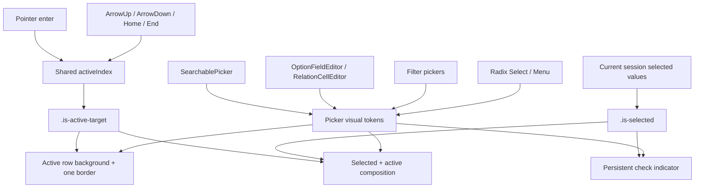

# 选择器交互状态视觉统一方案

## 方案概述

### 总体目标和范围

本方案目标是统一 data-editor 中列表型选择弹层的状态语义与视觉表达，解决当前 `selected`、`default-candidate`、`is-keyboard-active`、`:hover` 多套规则相互叠加造成的高饱和背景、双描边、多个视觉焦点和状态含义不清问题。

本方案采用“半合并”状态模型：

- `selected` 保持为独立的选择状态，表示该候选已经进入当前弹层会话的已选值；对于事务式编辑器，它可以是尚未提交的本地 draft。
- 鼠标 `hover` 与键盘活动项合并为唯一的 `active target`，表示当前点击或按 Enter 将操作的候选。
- 鼠标进入候选行和键盘方向键导航都更新同一个 `activeIndex`，任意时刻最多只有一个 active target。
- `default-candidate` 只允许作为活动项初始化的内部逻辑，不再产生独立视觉。
- `selected + active target` 采用状态合成：active target 负责整行背景和单层边框，selected 通过 `check` 等非颜色标识保留。

纳入范围：

- `SearchablePicker`
- `OptionFieldEditor`
- `RelationCellEditor`
- `MultiSelectFilterPopover`
- `AdvancedFilterRuleEditor`
- 添加筛选字段菜单
- Automation Settings 中的技能、目标文件和目标集合 picker
- Radix `Select` / `Menu` 的高亮与已选状态映射
- 表格和 detail panel 中复用上述编辑器的入口

不纳入范围：

- 不修改选择、取消选择、创建、重命名、删除、改色等业务语义。
- 不调整弹层尺寸、定位、滚动高度和整体布局。
- 不扩展深色主题；本轮先建立可被主题系统消费的 token。
- 不把普通按钮、表格行、侧栏导航等非 picker 场景强行迁入本合同。
- 不保留旧视觉与新视觉并存的兼容分支。

### 各阶段任务概要

第一阶段：建立状态矩阵和视觉 token。  
明确 `default`、`selected`、`active target`、`selected + active target`、`disabled` 五态，定义背景、边框、check、文字、动作图标和动画规则。预期成果是形成唯一的状态真值与 token 集合。

第二阶段：统一 active target 状态模型。  
让 pointer enter 与键盘导航写入同一个 `activeIndex`，移除 `default-candidate` 的独立视觉职责，并明确鼠标与键盘交替使用时的状态转换。预期成果是列表中不再同时出现 hover 行和 keyboard active 行。

第三阶段：迁移自定义 picker。  
依次迁移公共 `SearchablePicker`、字段选择器、relation、普通/高级筛选和 Automation Settings picker。预期成果是自定义列表使用同一状态 class、组合规则和视觉 token。

第四阶段：映射 Radix 状态。  
将 Radix 的 `[data-highlighted]`、`[data-state="checked"]` 等状态映射到相同 token。预期成果是 Radix 下拉与自定义弹层不再呈现两套视觉语言。

第五阶段：验证与收尾。  
补齐状态组合测试、输入方式切换测试和正式 8787 Browser 视觉验证，并复核 CSS 特异性、可访问性和遗漏入口。预期成果是形成稳定的选择器视觉合同和回归边界。

执行顺序为：状态矩阵与 token -> active target 状态统一 -> 自定义 picker 迁移 -> Radix 映射 -> 自动化与 Browser 验证。

### 整体结构框架



---

## 背景与现状结论

当前列表行同时存在以下视觉来源：

- `.selected`
- `.default-candidate`
- `.is-keyboard-active`
- `:hover`
- Radix `[data-highlighted]`
- Radix `[data-state="checked"]`

当前问题不是缺少状态，而是状态职责重叠：

1. `selected` 与 hover 共用背景，无法稳定区分“已经选中”和“鼠标经过”。
2. `default-candidate` 与 `is-keyboard-active` 同时标记同一候选，并分别设置背景、边框或 `box-shadow`。
3. 鼠标 hover 与键盘活动项可以出现在两行，形成两个当前焦点。
4. selected、active 和 default candidate 的组合通过 CSS 叠加形成，而不是显式定义组合态。
5. 自定义 picker 和 Radix 组件使用不同状态选择器，后续局部覆盖会继续扩大差异。
6. 彩色 chip 表达选项类别，但当前视觉容易让用户误以为 chip 深浅也在表达 selected。

截图中 `damage` 行出现的大面积蓝底和双层边界，就是 `default-candidate`、`is-keyboard-active` 与现有选中/悬停规则共同作用的结果。

---

## 核心决策：采用半合并模型

### 推荐结论

采用以下模型：

- selected 独立。
- hover 与 keyboard active 合并为唯一 active target。
- 输入来源可以继续在内部保留，但不产生第二套行级视觉。

### 为什么不完全分开

如果 hover 和 keyboard active 完全分开：

- 鼠标可以停在 A 行，键盘 active 停在 B 行。
- 用户无法立即判断 Enter 将作用于哪一行。
- 两行都需要视觉强调，列表噪声增加。
- `aria-activedescendant` 指向的目标可能与最醒目的 hover 行不同。

### 为什么不把 selected 也合并进去

selected 是当前弹层会话中的选择状态；active target 是下一次交互将作用的临时状态。二者生命周期和业务含义不同。如果完全合并，活动项移动后用户会失去对当前已选值的稳定识别。

对于 `OptionFieldEditor` 这类事务式编辑器，selected 视觉立即反映本地 draft，而不是等待弹层关闭后才更新。Escape 取消会恢复会话初始 selected，正常关闭提交后，外部值才成为下一次会话的初始状态。

### 两个正交状态维度

实现层不应维护大量互斥枚举，而应把状态拆成两个正交维度：

```text
Selection:
- unselected
- selected

Interaction:
- idle
- active
- disabled
```

`selected + active` 是两个维度的自然组合，不是第三套独立业务状态。

### 合并后的交互规则

```text
弹层打开
  -> 单选：优先当前值对应候选，缺失时使用首个有效候选
  -> 多选：优先首个未选候选，全部已选时回退首个有效候选

鼠标进入候选行
  -> activeIndex 更新到该行

键盘方向键移动
  -> activeIndex 更新到目标行

鼠标离开列表
  -> 保留 activeIndex，不制造空白闪烁

搜索结果变化
  -> 重新应用单选/多选各自的候选初始化规则

Enter 或点击
  -> 操作 activeIndex 对应候选
```

---

## 统一状态矩阵

| 状态 | 语义 | 背景 | 边框 | 非颜色标识 | 动作图标 |
|---|---|---|---|---|---|
| `default` | 普通未选候选 | 透明 | 透明占位边框 | 无 | 低对比度 |
| `selected` | 已进入当前弹层会话的已选值 | 极浅中性背景 | 透明或极浅中性边框 | 右侧 `check` | 保持低对比度 |
| `active target` | 当前点击/Enter 的目标 | 低饱和浅灰蓝 | 单层 1.5px 冷灰蓝 | 无额外图标 | 提升可见度 |
| `selected + active` | 已选且当前正在操作 | active 背景 | active 单层边框 | 保留 `check` | 提升可见度 |
| `disabled` | 不可操作 | 透明 | 透明 | 既有状态图标可保留 | 整行降低透明度 |

表中的 selected 应理解为“当前弹层会话已选”，不要求此时已经提交到外部数据源。

### 状态优先级

视觉优先级固定为：

```text
active target > selected > default
```

组合时不叠加两套背景或两层阴影：

- active target 决定整行背景和边框。
- selected 决定 check 和 `aria-selected`。
- disabled 最后覆盖可操作性和透明度。

---

## 视觉规范

### 1. Default

- 整行透明背景。
- 预留 1.5px 透明边框，避免状态变化造成布局跳动。
- 行圆角统一为 8px。
- 拖拽把手和 `...` 使用 muted 色。
- 不显示阴影。

### 2. Selected

- 使用极浅中性灰背景，避免与 active target 竞争。
- 右侧增加 14px `check`，不能只依赖背景颜色。
- check 使用中性深灰或低饱和主题色。
- 彩色 chip 保持自身类别颜色，不反色、不额外变暗。
- 不添加蓝色描边和第二层 box-shadow。

### 3. Active target

- 使用低饱和浅灰蓝背景。
- 使用单层 1.5px 冷灰蓝边框。
- 不使用当前截图中的高饱和蓝色大面积填充。
- 拖拽把手和 `...` 提升到正常可见度。
- `background-color`、`border-color`、`color` 即时切换，不使用过渡；高频指针移动时避免动画反复重启产生拖尾。
- 不使用位移、缩放、浮起或阴影动画。

### 4. Selected + active

- 直接使用 active target 的背景和边框。
- 保留 selected check。
- 不叠加 selected 背景。
- 不叠加第二层内阴影或外描边。

### 5. Disabled

- `opacity` 建议 0.45–0.5。
- 不响应 hover，也不能成为 active target。
- 保留必要的文字，以便用户理解选项存在。
- 禁止仅通过灰色背景表达 disabled。

### 6. 顶部 selected chip

顶部 selected chip 与候选行 selected 不属于同一层级：

- chip 保持选项类别颜色。
- 删除按钮默认降低可见度，hover/focus 时强化。
- hover chip 只强化删除按钮，不改变 chip 类别色。
- 删除按钮键盘聚焦使用局部 focus ring，不给整个 chip 增加 active row 背景。

### 7. 焦点与高对比模式

- 使用 `aria-activedescendant` 时，真实 DOM 焦点仍在搜索输入框，输入框必须继续显示可见 focus ring。
- active row 只表达当前候选目标，不能替代输入框或触发器的焦点反馈。
- `forced-colors: active` 下不能只依赖背景色；应使用系统色 `Highlight` / `HighlightText`、可见 `outline` 或等效非背景标识。
- 推荐 token 必须在正式页面验证对比度，不把本方案中的十六进制值视为未经校准即可冻结的最终色值。

---

## 推荐视觉 Token

建议先建立以下 token，再迁移组件：

```css
:root {
  --picker-row-bg: transparent;
  --picker-row-selected-bg: #f7f7f5;
  --picker-row-active-bg: #eef2f7;
  --picker-row-active-border: #c8d4e3;
  --picker-row-border-width: 1.5px;
  --picker-row-selected-check: #526273;
  --picker-row-muted-icon: #969692;
  --picker-row-active-icon: #696a6d;
  --picker-row-disabled-opacity: 0.46;
  --picker-row-radius: 8px;
  --picker-row-transition: 0ms linear;
}
```

以上颜色是首版建议值，实施时应在正式 8787 页面结合现有主题变量做一次视觉校准。最终优先使用语义 token，不在组件局部继续增加十六进制色值。

### 统一状态 class

自定义 picker 最终统一使用：

```text
.is-selected
.is-active-target
.is-disabled
```

应删除视觉职责：

```text
.default-candidate
.is-keyboard-active
```

如果 `default-candidate` 仍用于业务计算，应更名或限制为逻辑字段，禁止继续绑定视觉规则。

---

## 组件迁移方案

### SearchablePicker

- 列表容器使用事件代理处理真实 pointer 移动，通过 `closest('[role="option"]')` 定位候选并更新公共 `activeIndex`。
- 只响应 `mouse` / `pen`，忽略 touch，避免触摸滚动产生粘滞 hover。
- 指针仍位于同一候选时不重复 setState。
- 仅元素因滚动或布局变化移动到静止指针下时，不应抢走键盘 active；必须由新的真实 pointer movement 触发同步。
- 键盘导航继续更新同一 `activeIndex`。
- DOM 只输出 `.is-active-target`。
- `.is-selected` 从业务传入或现有 class/`aria-selected` 同步。
- `aria-activedescendant` 必须始终指向 `.is-active-target`。
- 删除独立产生背景的 `:hover` 规则；鼠标经过的视觉也必须由 `.is-active-target` 驱动。

### OptionFieldEditor

- 将当前 row 上的 `selected`、`default-candidate`、`is-keyboard-active` 收敛为 `.is-selected` 和 `.is-active-target`。
- selected option row 在右侧动作区显示 check；`...` 只在 active/hover 时强化。
- 行结构固定为 `drag handle | label/chip + selected check | contextual action`。check 位于主选择按钮内部右侧，`...` 继续使用独立尾槽，二者不互相替换。
- 拖拽把手仍保留，但不承担 selected 或 active 表达。
- 创建新选项行作为可操作候选时，遵循同一 active target 视觉。

### RelationCellEditor

- 与 OptionFieldEditor 使用相同 row token。
- 保留“打开目标记录”业务动作，不让跳转图标替代 selected check。
- relation 主选择区内部保留 selected check，“打开目标记录”继续使用独立 contextual action 槽位。
- 单选和多选的 selected 视觉相同，业务行为继续分流。

### 普通与高级筛选

- checkbox 继续表达多选控制，但 selected row 仍使用统一浅背景和 check/checked 控件。
- checkbox 自身是 selected 的非颜色标识，因此无需再增加第二个 check；行尾可保留空位对齐。
- 普通筛选和高级筛选使用同一状态 class，禁止两套局部覆盖。
- 当前 `.default-candidate` 视觉必须删除。

### 添加筛选字段菜单

- `[role="menuitem"]` 的 pointer 与键盘焦点使用 active target token。
- 菜单项不是持久多选，因此通常只有 default/active/disabled 三态。
- `:focus-visible` 与 pointer hover 映射到同一背景和边框。

### Automation Settings picker

- 已迁移到 `SearchablePicker` 的技能、目标文件、目标集合直接继承公共状态合同。
- 禁止在 `.automation-*` 局部重新覆盖 active/selected 背景。

### Radix Select / Menu

映射规则必须限制在选择器容器内，禁止使用影响全站菜单的裸属性选择器：

```css
.picker-select-content [data-highlighted] {
  /* active target token */
}

.picker-select-content [data-state="checked"] {
  /* selected token */
}

.picker-select-content [data-highlighted][data-state="checked"] {
  /* selected + active composition */
}
```

Radix 继续负责焦点管理和键盘行为，本轮只统一视觉映射。`Radix Select` 可以使用完整的 selected/active 合同；普通 action menu 只允许共享 active token，不引入 selected 语义。

---

## CSS 结构建议

推荐建立集中式状态层，而不是继续按组件追加覆盖：

```css
:where(.picker-option, .multi-select-option-row, .filter-option-row, .picker-select-content .menu-item) {
  background: var(--picker-row-bg);
  border: var(--picker-row-border-width) solid transparent;
  border-radius: var(--picker-row-radius);
  transition:
    background-color var(--picker-row-transition),
    border-color var(--picker-row-transition),
    color var(--picker-row-transition);
}

:where(.picker-option, .multi-select-option-row, .filter-option-row, .picker-select-content .menu-item).is-selected {
  background: var(--picker-row-selected-bg);
}

:where(.picker-option, .multi-select-option-row, .filter-option-row).is-active-target,
.picker-select-content :where(.menu-item)[data-highlighted] {
  background: var(--picker-row-active-bg);
  border-color: var(--picker-row-active-border);
}
```

实施时应根据真实 DOM 调整基础选择器，但状态规则必须集中，不允许在文件末尾再次追加同等职责的覆盖。

### 一次性 class 迁移顺序

1. 组件开始输出 `.is-selected` 和 `.is-active-target`。
2. 在同一批改动中删除旧 `.selected`、`.default-candidate`、`.is-keyboard-active` 的行级视觉职责。
3. 保留旧 class 仅用于其他明确业务时，必须改名或加作用域，禁止继续影响 picker row。
4. 测试应断言候选行不再依赖具有视觉职责的 `.default-candidate`。
5. 不允许新旧状态 class 以兼容分支长期共存。

---

## 实施阶段

### 第一阶段：状态与 token 落地

主要工作：

- 新增 picker 状态 token。
- 建立集中式状态规则。
- 删除 `default-candidate` 的视觉 CSS。
- 定义 check 与动作图标槽位。

预期成果：

- 视觉真值只有一处。
- 现有组件尚未全部迁移时，也不会继续增加新状态规则。

### 第二阶段：统一 activeIndex

主要工作：

- pointer enter 写入 `activeIndex`。
- pointer 事件通过列表容器代理，只响应 mouse/pen 的真实移动并忽略 touch。
- 键盘导航沿用同一 `activeIndex`。
- pointer 与键盘切换不产生第二活动项。
- 筛选和搜索结果变化后正确复位活动项。

预期成果：

- hover 与 keyboard active 在状态层和视觉层均合并。

### 第三阶段：迁移自定义 picker

执行顺序：

1. `SearchablePicker`
2. `OptionFieldEditor`
3. `RelationCellEditor`
4. 普通筛选与高级筛选
5. 添加筛选字段菜单
6. Automation Settings picker

预期成果：

- 所有自定义列表型 picker 使用同一状态 contract。

### 第四阶段：Radix 映射

主要工作：

- 映射 `[data-highlighted]`。
- 映射 `[data-state="checked"]`。
- 清理 Radix content 内部冲突的 hover/selected 规则。

预期成果：

- 原生 Radix 下拉与自定义 picker 的状态视觉一致。

### 第五阶段：验证与收尾

主要工作：

- 补状态组合 Playwright 断言。
- 正式 8787 Browser 对照截图验证。
- 检查表格、detail panel、筛选、Automation Settings。
- 使用 recheck 复核 CSS 特异性、遗漏组件和可访问性。

预期成果：

- 视觉合同稳定可复用，不再依赖局部补丁。

---

## 验证矩阵

### 状态组合

- default
- selected
- active target
- selected + active target
- disabled
- disabled + selected

### 输入方式切换

- 鼠标进入候选后按 ArrowDown。
- 键盘移动后鼠标进入其他候选。
- 鼠标离开列表后继续按键盘。
- 触摸滚动列表不会产生粘滞 active target。
- 列表滚动或布局变化不会在没有真实 pointer movement 时抢走键盘 active。
- 滚动列表后 active target 保持可见。
- 搜索过滤后 active target 复位到有效项。

### 业务场景

- 单选确认后关闭。
- 多选确认后保持弹层打开。
- 已选项再次 Enter 取消选择。
- relation 选择和打开目标记录动作互不冲突。
- 筛选 checkbox、整行点击和键盘 Enter 行为一致。
- 创建新选项行能成为 active target。
- Radix Select 的 highlighted/checked 与自定义 picker 一致。

### 视觉检查

- 任意时刻最多一个 active target。
- 不出现双描边或叠加 box-shadow。
- selected 在 active target 移开后仍清晰可见。
- selected 不只依赖背景颜色。
- 彩色 chip 不因 selected/active 改变类别色。
- 拖拽把手和更多按钮只在 active target 时强化。

---

## 自动化验证建议

### 纯逻辑测试

- pointer enter 与键盘移动更新同一 active index。
- 活动项循环、Home/End 和禁用项跳过保持正确。
- 搜索结果改变时活动项复位。
- selected 状态变化不会无故重置 active target。

### Playwright

- 断言同一列表中 `.is-active-target` 数量始终不超过 1。
- 断言 pointer hover 后 `aria-activedescendant` 与目标行一致。
- 断言键盘移动后旧行失去 active class，新行获得 active class。
- 断言 selected + active 的最终 computed `background-color`、`border-color` 和 `box-shadow` 符合唯一合同值。
- 使用稳定截图回归检查组合态，不尝试从 Playwright 判断 CSS 声明来源。
- 覆盖 Option、Relation、Filter、SearchablePicker 和 Radix Select。
- 覆盖输入框 focus ring 与 active row 同时可见。
- 覆盖 `forced-colors` 下 active 与 selected 仍有非背景标识。

### Browser 视觉验证

正式验证入口：

```text
http://127.0.0.1:8787/
```

重点对照长列表、多色 chip、已选多个值、滚动条可见和 detail panel 边缘弹层场景。

---

## 风险与控制

### 风险 1：鼠标移动频繁覆盖键盘活动项

控制方式：只有 mouse/pen 的真实 `pointermove` / `pointerover` 才更新 activeIndex；忽略 touch；弹层滚动或布局变化不得在没有新 pointer movement 时重置活动项。

### 风险 2：selected check 与更多菜单争夺右侧空间

控制方式：固定采用 `drag handle | label/chip + selected check | contextual action`；check 位于主选择按钮内部，option menu 或 relation action 使用独立尾槽，避免行宽和操作位置跳动。

### 风险 3：Radix 与自定义组件 DOM 不同

控制方式：共享视觉 token 和状态语义，不强求 DOM class 完全一致；Radix 通过 data attribute 映射。

### 风险 4：旧 CSS 特异性覆盖新 token

控制方式：迁移组件时同步删除旧 `.default-candidate`、selected/hover 局部规则，不使用更高特异性强压旧规则。

### 风险 5：仅靠视觉截图验证，遗漏状态转换

控制方式：视觉截图与状态数量、ARIA 指向、键盘路径断言同时存在。

### 风险 6：selected 与 option 分类色混淆

控制方式：类别色只存在于 chip；selected 使用 check 和浅中性行背景，不改变 chip 色板。

### 风险 7：事务式 draft 被误认为已提交值

控制方式：selected 统一定义为“当前弹层会话已选”；OptionFieldEditor 的 Escape 恢复初始状态、正常关闭提交外部状态必须进入验证矩阵。

---

## 验收标准

本方案实施完成必须同时满足：

1. 任意列表中最多只有一个 active target。
2. hover 与 keyboard active 使用同一状态和同一视觉。
3. selected 独立存在，并有 check/checkbox 等非颜色标识。
4. selected + active 不产生双背景、双边框或多层阴影。
5. `default-candidate` 不再承担视觉职责。
6. 自定义 picker 与 Radix Select 使用同一 token。
7. 鼠标、键盘切换和搜索过滤后的活动项行为可预测。
8. 表格、detail panel、筛选器和 Automation Settings 的视觉一致。
9. 多选初始化继续优先首个未选候选，不改变现有 Enter 新增语义。
10. Radix 状态样式限制在选择器容器内，不影响普通 action menu。
11. 输入框真实 focus ring 与 active row 提示同时存在，forced-colors 下仍可识别。
12. 事务式编辑器的 selected draft、Escape 恢复和正常提交行为正确。
13. 定向自动化、typecheck、build 和正式 Browser 视觉验证通过。

---

## 最终建议

最终采用“selected 独立，hover 与 keyboard active 合并”的半合并模型。

这是当前最适合 data-editor 的方案：它保留了持久选择状态的清晰度，同时把鼠标和键盘统一成唯一的下一步操作目标，能够直接消除截图中多个高亮、双描边和状态含义模糊的问题；配合集中 token 和状态 class，也能显著降低后续继续调整选择器视觉时的维护成本。
